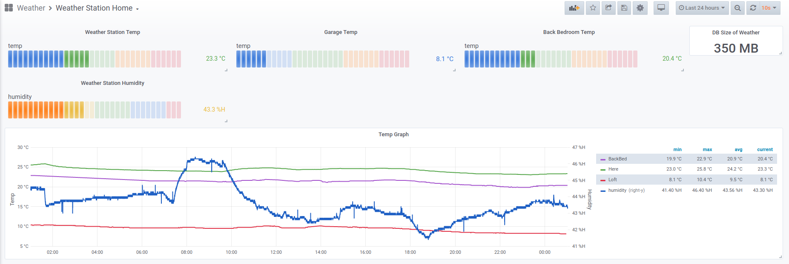

= Weather Station Plus ReadMe

== Introduction

This is the software for a physical box I built from a raspberry pi and arduino. It consists
of a central box with remote weather sensors sending data over 433Mhz radio.

More information can be found here: https://blog.monotok.org/weather-station-plus/[WeatherStationPlus Blog]

== Build

=== Requirements

Install the required packages:

`sudo apt install libpq-dev libpqxx-dev git cmake gcovr`

Additional packages for cross platform building:

`sudi apt install qemu-user-static docker-ce docker-compose`

=== Cmake

The basic build can be run like so.

----
mkdir build
cd build
cmake -DCMAKE_BUILD_TYPE=Debug ..
----

Now run make to build the binary. There are quite a few build targets but main program is "weatherStationPlus"

`cmake --build . --target weatherStationPlus`

Now inside the build directory the executable should be the available. Sudo is needed for access to the i2c interfaces.

Run with `sudo ./weatherStationPlus`

=== Cross Platform Build via Docker

. Create a .env variable with (Replace user with matching host user and uid. Can then optionally bind git directory inside the container):

----
	USERNAME=gitlab-runner
	USERID=999
	GROUPID=998
----

. sudo apt install qemu-user-static
. docker-compose up -d
. cp the git dir into the container or git clone
docker cp . arm_v6_raspberrypi_one:/home/gitlab-runner/code/
. docker exec -i --user gitlab-runner arm_v6_raspberrypi_one bash -c "cd /home/gitlab-runner/code && mkdir -p build && cd build && cmake -DCMAKE_BUILD_TYPE=Debug .."

To build the tests we run:

----
docker exec -i --user gitlab-runner arm_v6_raspberrypi_one bash -c "cd /home/gitlab-runner/code && mkdir -p build && cd build && cmake --build . --target test_all_unit"
docker cp arm_v6_raspberrypi_one:/home/gitlab-runner/code/test/unit/bin/test_all_unit test/unit/bin/test_all_unit
----

*or* to build the main application we run:

----
docker exec -i --user gitlab-runner arm_v6_raspberrypi_one bash -c "cd /home/gitlab-runner/code && mkdir -p build && cd build && cmake --build . --target weatherStationPlus"
mkdir -p bin/debug
docker cp arm_v6_raspberrypi_one:/home/gitlab-runner/code/bin/debug/weatherStationPlus bin/debug/
----

. docker-compose down
. upload as an artifact
. via next job via pi run and optionally collect cov
. upload test report

=== IDE Integration

== Gitlab Runner

Need to comment out the contents of the bash_logout file within the home directory of the
runner. See https://gitlab.com/gitlab-org/gitlab-runner/-/issues/1379[Gitlab Runner Issue]

eg: `/home/gitlab-runner/.bash_logout`

Allow the gitlab-runner account to run sudo commands without a password.

Add the following: `gitlab-runner ALL=(ALL) NOPASSWD: ALL` to a new file `/etc/sudoers.d/020_gl-nopasswd`

== Tests

To build the tests. There are several test targets but the `test_all_unit` will test everything.

----
mkdir build
cd build
cmake -DCMAKE_BUILD_TYPE=Debug ..

cmake --build . --target test_all_unit

cd test
sudo ./test_all_unit --gtest_output="xml:report.xml"
----

=== Coverage

Run this after executing the test binary.

`make cov`

To manually run the coverage.

----
mkdir coverage
lcov --capture --directory CMakeFiles/test_all_unit.dir/ --output-file coverage/coverage.info
genhtml coverage/coverage.info --output-directory coverage
----

HTML report is located within the coverage directory.

== Configuring the Application

There are two configuration files, one for the logging and the other for the application itself.

The logging mechanism uses easylogging++ and all the detailed settings can be found https://github.com/amrayn/easyloggingpp[Easylogging Github].

The application settings should be placed in the `conf` directory, if running this as a binary then it should be placed inside a `conf` directory one level up. For example:

....
/opt/wsp/bin/weatherStationPlus
/opt/wsp/conf/settings.conf
....

Example Setting File:

....
version = 1.0;

sensors =
{
    s1 = {
        id = 1;
        name = "Shed";
    };
    BackBed = {
        id = 2;
        name = "Backbed";
    };
    Loft = {
        id = 3;
        name = "Shed";
    };
}

database =
{
    host = "172.16.20.5";
    port = 5432;
    database = "weather";
    user = "weather";
    password = "siesta_Usn_4Gulag_";
};

gpio =
{
    gpio1 = "17";
    gpio2 = "27";
    gpio3 = "22";
    gpio4 = "18";
    gpio5 = "17";
};

i2c =
{
    busno = 3;
    atmega = 4;
    lcd = 63;
};

logging =
{
    configFile = "conf/logging.conf";
};
....

== PostgreSQL / Timescale DB

So if you want to save the data into a database then the application currently supports postgresSQL.
TimescaleDB is an addon for postgresSQL that makes it very good for storing time series data, eg data from an IOT sensor.

=== Quick Install Guide (PostgreSQL & TimescaleDB)

==== Install

This can be a remote database or a local one. A remote database is probably best as it reduces writes to the sd card of the pi.
Assuming you are install this on a remote Ubuntu 18.04 server.

. Install postgres from the Ubuntu repo.
.. `sudo apt install postgresql`
. Add timescaledb repo and install
.. `sudo add-apt-repository ppa:timescale/timescaledb-ppa`
.. `sudo apt-get update`
.. `sudo apt install timescaledb-postgresql-10`
.. `sudo timescaledb-tune` (Optional, read the official documentation on tuning [Tuning](https://docs.timescale.com/latest/getting-started/configuring))

==== Configuring the DB

. Login to the DB user `sudo su - postgres`
. Now enter the command line utility `psql`
. Create the weather station user `create role weather login password 'password goes here';`
. Create the database `create database weather with owner = 'weather';`
. Quit the utility `\q`
. Test logging in with the new user `psql -h localhost -d weather -U weather`

==== Configure Remote Access

We want to allow the remote user and others access to the database over the network.

Edit `sudo vim /etc/postgresql/10/main/pg_hba.conf`

Now add this towards the top of the file. Replace the network range with your LAN.

`host  all  all 192.168.1.0/24 md5`

Now edit the postgresql.conf file. `sudo vim /etc/postgresql/10/main/postgresql.conf`

Change the listen address `listen_addresses = '*' `

==== Restart service

Restart the service `sudo service postgresql restart` to apply the changes.

==== Enable timescaledb extension on the new database

This must be done via the postgres account.

`sudo -u postgres psql`

`\c weather`

`create extension if not exists timescaledb cascade;`

This should show.

[source]
----
WARNING:
WELCOME TO
 _____ _                               _     ____________
|_   _(_)                             | |    |  _  \ ___ \
  | |  _ _ __ ___   ___  ___  ___ __ _| | ___| | | | |_/ /
  | | | |  _ ` _ \ / _ \/ __|/ __/ _` | |/ _ \ | | | ___ \
  | | | | | | | | |  __/\__ \ (_| (_| | |  __/ |/ /| |_/ /
  |_| |_|_| |_| |_|\___||___/\___\__,_|_|\___|___/ \____/
               Running version 1.5.1
For more information on TimescaleDB, please visit the following links:

 1. Getting started: https://docs.timescale.com/getting-started
 2. API reference documentation: https://docs.timescale.com/api
 3. How TimescaleDB is designed: https://docs.timescale.com/introduction/architecture

Note: TimescaleDB collects anonymous reports to better understand and assist our users.
For more information and how to disable, please see our docs https://docs.timescaledb.com/using-timescaledb/telemetry.

CREATE EXTENSION

----

=== Create the DB Schema

[source,sql]
----
create schema sensors;
create table sensors.data
(
    sensorid    text                     not null,
    time        timestamp with time zone not null,
    temperature double precision default 0,
    humidity    double precision default 0,
    battery     integer
);

SELECT create_hypertable('sensors.data', 'time');

create index data_sensorid_time_idx
    on sensors.data (sensorid asc, time desc);

create index data_temp_index
    on sensors.data (time desc, temperature asc)
    where (temperature IS NOT NULL);

create index data_hum_index
    on sensors.data (time desc, humidity asc)
    where (humidity IS NOT NULL);

----

=== Graphana

There exists a plugin for grafana to read postgreSQL.

Below is an example screenshot of my grafana instance.

